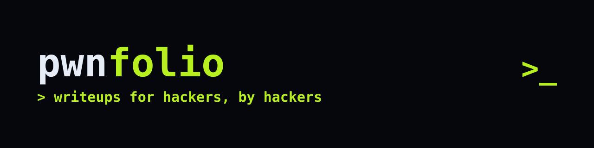

# pwnfolio

> writeups for hackers, by hackers

<p align="center">
  
</p>

<p align="center">
  
  
  
  
  
  
  
  
</p>

A full-stack CTF writeup sharing platform with a hacker/terminal aesthetic. Built as a monorepo — Express API + React SPA sharing a single set of Zod validation schemas.

**Live:** https://pwnfolio.vercel.app
**API:** https://pwnfolio.onrender.com

---

## Stack

**Backend:** Express 5 · MongoDB (Mongoose 9) · TypeScript · Zod
**Frontend:** React 19 · Vite 6 · Tailwind v4 · Framer Motion · Recharts
**Testing:** Vitest + Supertest + mongodb-memory-server — 100 backend tests across 10 files, plus 19 frontend tests (Vitest + Testing Library, jsdom); strict TS throughout
**Deployment:** Render (API) · Vercel (client, proxied) · MongoDB Atlas

---

## Architecture

```
pwnfolio/
├── shared/schemas.ts   # Zod schemas — single source of truth for
│                        # client + server validation
├── src/                 # Express API
│   ├── routes/          # auth, writeups, users
│   ├── controllers/     # auth, writeup, comment, like, saved, stats, user
│   ├── models/           # User, Writeup, Comment, Like, SavedWriteup
│   ├── middleware/       # JWT auth, rate limiting, zod validation
│   └── scripts/          # migrations (e.g. usernames)
└── client/               # React SPA
    └── src/pages/         # Home, Writeup, Editor, My/Saved, Profile, Stats, Auth, 404
```

The same Zod schemas are the single source of truth for data shape: the server validates every request body with them at runtime, and the client derives its TypeScript types straight from them (`z.infer`) — no drift between what the UI accepts and what the API accepts.

### Why a monorepo with a shared validation layer

Keeping `shared/schemas.ts` outside both `src/` and `client/` means both sides import the exact same runtime validators and inferred TypeScript types. Change a field once, both client and server pick it up — no duplicated interfaces silently going out of sync.

---

## Backend features

- **Auth** — JWT (httpOnly cookies) + bcrypt password hashing, login/register/change-password, rate-limited auth endpoints, helmet-hardened headers
- **Writeups** — full CRUD with structured sections (recon / approach / exploit-chain / takeaway), tags, CVE references, platform, difficulty, draft/published status — all validated server-side by the shared Zod schemas
- **Social** — likes, save-for-later, threaded comments, view counting, featured writeup flag
- **Users** — public profiles (markdown bio, interests, 7 social links), usernames, a stats endpoint aggregating activity over 12 months by category/difficulty/platform
- **Quality** — 100 backend tests (10 files) + 19 frontend tests (Vitest + Testing Library with jsdom), strict TypeScript

## Frontend features

- **Home** — search + filters (category/difficulty/platform/tag), sort, pagination, featured banner
- **Writeup page** — reading progress bar, GFM markdown with syntax highlighting and a code copy button, table of contents, sticky meta panel, like/save, comments
- **Editor** — vim-flavored UI (`:w` to save draft, `:wq` to publish), delete
- **Stats** — Recharts area/bar/pie charts, stat cards, difficulty legend
- **Profiles** — category distribution bar, stats strip, markdown bio, link chips, editable settings + password change
- **Design** — terminal/neon aesthetic, selectable dark/light themes, terminal `$`-prompt microcopy throughout, Framer Motion transitions
- **Responsive** — desktop sidebar collapses to a mobile slide-in drawer (hamburger, backdrop, Escape-to-close, scroll lock); sidebar narrows on smaller laptop breakpoints

---

## Security

Since this is a platform for sharing exploit writeups, treating its own security carelessly would be a bad look — so:

- **Password storage** — bcrypt-hashed, never stored or logged in plaintext
- **Sessions** — JWT access + refresh tokens in httpOnly, secure cookies (not accessible to client-side JS, mitigating XSS-based token theft)
- **Rate limiting** — `express-rate-limit` on auth endpoints to slow brute-force attempts
- **Input validation** — every request body validated server-side against the shared Zod schemas before it touches the database or business logic
- **Injection protection** — strict Zod parsing strips unknown keys, so MongoDB `$`-operator payloads are rejected before they ever reach the database
- **XSS protection** — writeup and comment content (which frequently contains code snippets and raw markup) is sanitized before rendering
- **Headers** — `helmet` for standard hardened HTTP headers, strict CORS scoped to the deployed frontend origin
- **Authorization checks** — every write/delete/edit path verifies resource ownership server-side, not just hidden in the UI
- **Same-origin cookies in production** — the deployed frontend proxies `/api/*` and `/health` through Vercel to the Render backend, so auth cookies never cross origins and can stay `SameSite=Strict` — stronger than the `SameSite=Lax`/`None` cookie configurations a cross-origin setup would force

---

## Deployment

- **Backend** — Render Web Service (free tier), built from the monorepo root so it can resolve `shared/`, connected to MongoDB Atlas
- **Frontend** — Vercel, Root Directory `client/`, install step also installs root dependencies so the shared schemas resolve their own dependencies (Zod) correctly
- **Routing** — `vercel.json` rewrites `/api/*` and `/health` to the Render backend before falling back to the SPA's `index.html`, keeping frontend and backend effectively same-origin from the browser's point of view
- **Uptime** — monitored via UptimeRobot on a 5-minute interval to keep the free Render instance warm and catch downtime early; the `/health` probe returns **503 when MongoDB drops**, so the monitor doubles as DB alerting

---

## Running locally

```bash
# backend
npm install
cp .env.example .env   # fill in MONGO_URI, JWT secrets, etc.
npm run dev

# frontend
cd client
npm install
npm run dev
```

---

## Notes

Built as a portfolio project to demonstrate full-stack backend engineering — schema-driven validation shared across a monorepo, JWT auth done properly, aggregation-pipeline stats, and a production deployment debugged end-to-end (cross-origin cookie handling, monorepo dependency resolution, IP allowlisting, TypeScript build config) rather than just scaffolded and left running locally.
